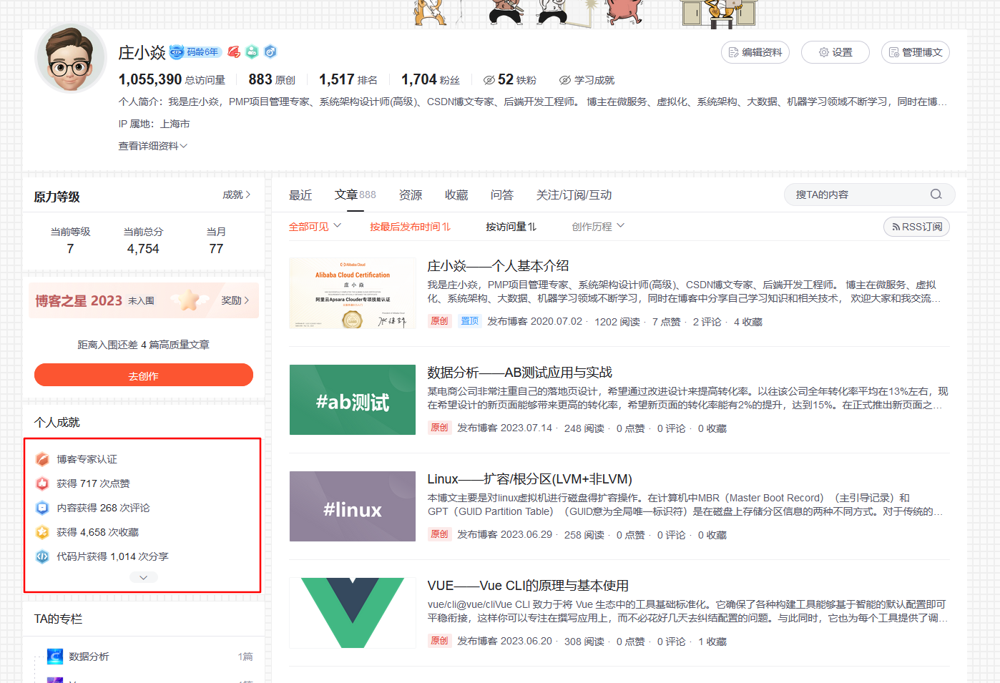
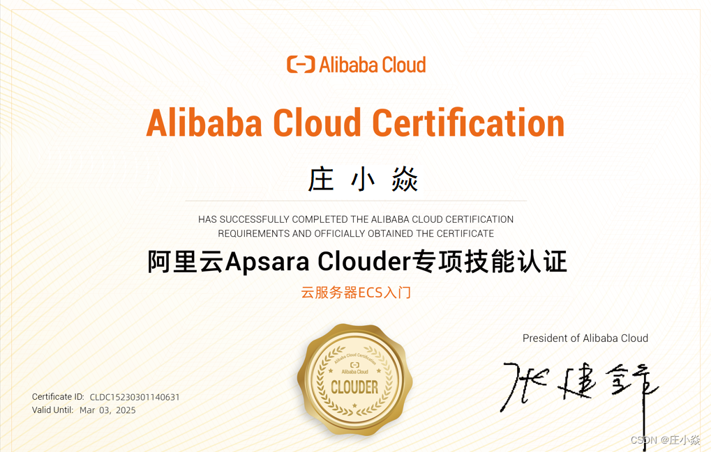

# <h1 align="center">《庄小焱——努力成长为一名优秀的架构师》</h1>

<h3>我是庄小焱。任职于世界100强软件研发中心，PMP项目管理专家、系统架构设计师(高级)、CSDN博文专家.博主在系统架构、容器化技术、大数据、机器学习领域不断学习,同时我将在博客中持续不断分享自己的学习知识和相关技术解决方案,欢迎大家和我交流学习,欢迎大家关注我的博客.</h3>

# 个人证书

# 博文资源

- [庄小焱网站](https://2462612540.github.io/zhuangxiaoyan/)
- [庄小焱github](https://github.com/2462612540)
- [庄小焱gitee](https://gitee.com/xjl2462612540)
- [庄小焱CSDN](https://blog.csdn.net/weixin_41605937?type=blog)
- [庄小焱雀语](https://www.yuque.com/dashboard/my_books)

# 联系方式

> 如果你有什么问题想与我沟通交流的话你可以使用邮件或者微信与我联系.
> 我的邮箱是：18279148786@163.com,我的微信号:Mike-Scofield-Love

# 博文参考

- https://www.vuepress.cn/config/#palette-styl
- https://blog.csdn.net/xiaoxianer321/article/details/119548202